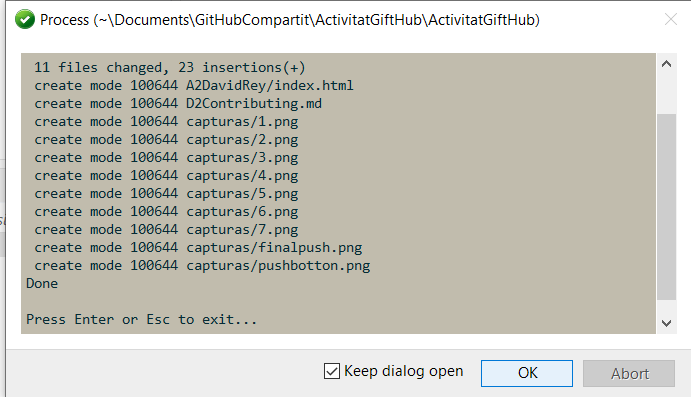

# How to add users to our github.

We give permissions to our mate. On the settings of the foulder and after Collaborators.
# How to clone with Git Extensions.

First we have created a token with acess to our git repository.
After that we created an folder on our local drive.
And we then clone our Git repository to our local drive.

## How to push new Documents.
We Press the push Botton.

After we can just select to where we want to push it and from whitch branch we want to do it.

## We create the shared folder with the name of our mate.

## We create an index.html inside the folder.

## We push the changes that we have done.

